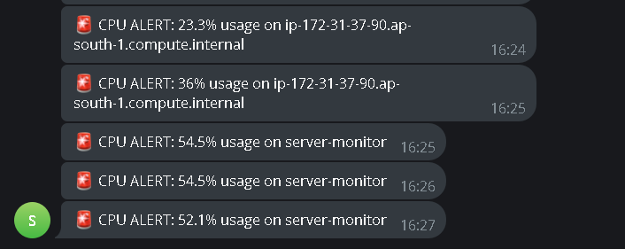
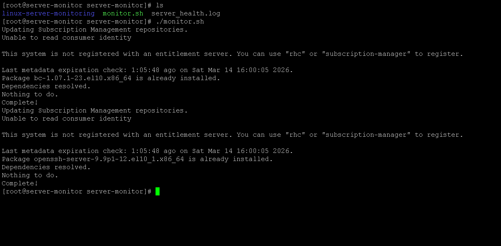
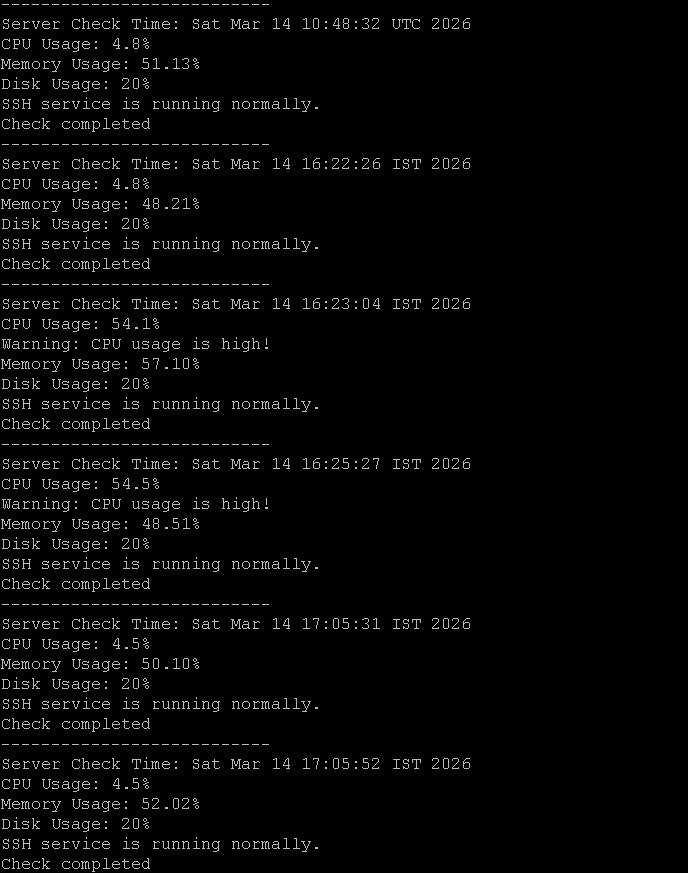

# Linux Server Monitoring Automation with Telegram Alerts

## Overview

This project is a Bash-based Linux automation tool that monitors server health and sends real-time alerts through Telegram.
The script checks system resources such as CPU usage, memory usage, disk space, and service status. If any resource crosses a defined threshold or a service stops, the system automatically sends a Telegram alert and logs the event.

---

## Features

• CPU usage monitoring

• Memory usage monitoring

• Disk space monitoring

• Automatic service restart (SSH)

• Telegram alert notifications

• Logging of server health status

• Automated monitoring using cron jobs

---

## Technologies Used

Linux

Bash Scripting

Cron Jobs

Systemctl (Service Management)

Telegram Bot API

Git & GitHub

---

## How It Works

1. The Bash script collects CPU, memory, and disk usage information.

2. If usage exceeds predefined limits (e.g., 80%), an alert is triggered.

3. The script checks whether the SSH service is running.

4. If SSH is down, it automatically restarts the service.

5. A Telegram alert is sent to notify the administrator.

6. All events are recorded in a log file for monitoring history.

---

## Example Telegram Alert

CPU ALERT

CPU usage: 91%

Server: Server-monitor

---

## Automation with Cron

The monitoring script is scheduled using cron to run every 5 minutes.

Example cron configuration:

*/5 * * * * /linux-server-monitoring/monitor.sh

This ensures continuous monitoring of server health.

---

## Setup Instructions

### 1. Clone the Repository

git clone [https://github.com/Abhaysinh031/Linux-server-monitoring.git]

### 2. Navigate to the Project Folder

cd linux-server-monitoring

### 3. Make Script Executable

chmod +x monitor.sh

### 4. Open Crontab

Run:

```

crontab -e

```

Add this line:

```

*/5 * * * * /linux-server-monitoring/monitor.sh

```

### 5. Configure Telegram Bot

Edit the script and add your Telegram Bot Token and Chat ID.

BOT_TOKEN="bot_token"

CHAT_ID="chat_id"

### 6. Run the Script

./monitor.sh

---

## Skills Demonstrated

Linux System Administration
Bash Automation
Process Monitoring
Service Management
Cron Job Scheduling
API Integration
Git Version Control

---

## Future Improvements

• Log rotation for automatic cleanup of old logs
• Multi-server monitoring
• Email alert integration
• Dashboard for server health metrics

---

## Screenshots

### Telegram Alert


### Script Running


 
### Log File Output



---

## Author

Abhaysinh Deshmukh
Linux & Cloud Enthusiast
